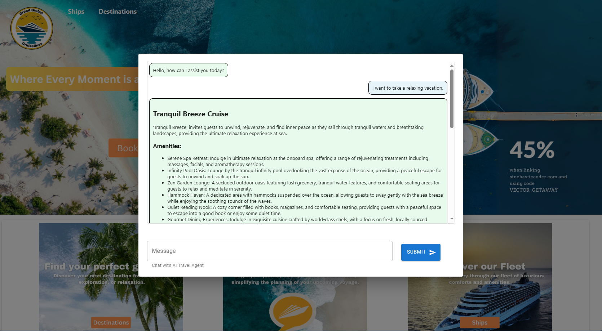

# AI Travel Agent Powered by Azure Cosmos DB and LangChain

## Overview
This repository features a demo of an AI Travel Assistant that utilizes Azure Cosmos DB for vector search and chat history management, ensuring a responsive and feature-rich chat experience. Prompt requests are efficiently handled by Python FastAPI, while a user-friendly front-end is built with React JS.

## Objectives

- Develop a conversational AI agent capable of understanding natural language input.
- Implement a robust backend system using Python FastAPI for handling user requests and interactions.
- Utilize LangChain for natural language understanding and processing, enabling the AI agent to comprehend user intents and context.
- Integrate Azure Cosmos DB as the database solution for storing conversation history, user preferences, and other relevant data.
- Design a user-friendly front-end interface using React JS, providing an intuitive platform for users to interact with the AI agent.

## Requirements
- Azure subscription for deploying Azure Cosmos DB for MongoDB vCore.
- Python environment with LangChain installed.
- Basic knowledge of MongoDB and natural language processing concepts.

## Usage
1. Follow the steps provided in the README file.

## Steps
1. [Step 1](loader) - Load  Cosmos DB for Mongo DB Vector Store using sample dataset
2. [Step 2](api) - Create FastAPI to integrate LangChain RAG pattern with web front-end.
3. [Step 3](web) - Build the React web front-end to ask 'grounded' questions of your data and view relevant documents. 
4. Follow the setup instructions provided in the README file.
5. Run the demo application and explore the RAG pattern in action.

## License
This project is licensed under the [MIT License](MIT.md), granting permission for commercial and non-commercial use with proper attribution.

## Support
For any questions or issues, please [open an issue](https://github.com/jonathanscholtes/Travel-AI-Agent-React-FastAPI-and-Cosmos-DB-Vector-Store/issues) on GitHub or reach out to the project maintainers.

## Disclaimer
This demo application is provided for educational and demonstration purposes only. Use at your own risk.