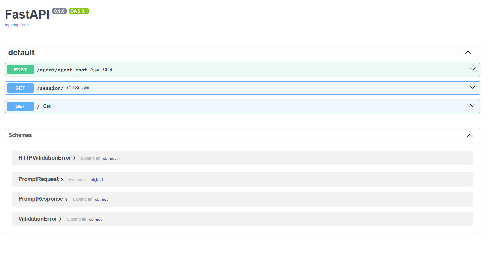

# Python FastAPI Project with LangChain for AI Travel Agent

## Overview
This Python FastAPI project integrates LangChain for implementing an AI Agent, leveraging a CosmosDB vector store for text retrieval and to query. 

## Features
- Utilizes FastAPI for building a high-performance web API.
- Integrates LangChain for implementing AI Agent 
- Utilizes CosmosDB vector store for efficient text retrieval based on semantic similarity.


## Requirements
- Python environment with FastAPI, LangChain, and Azure SDK installed.
- Access to Azure subscription for deploying CosmosDB.
- Basic knowledge of FastAPI, LangChain and CosmosDB.

## Usage
1. Clone the repository to your local machine.
2. Set up CosmosDB for MongoDB VCore Vector Store in your Azure subscription.
3. Create **.env** file and populate:
- OPENAI_API_KEY=''
- MONGO_CONNECTION_STRING=''
4. Create pythonn env: 
```
python -m venv venv
```
5. Install Requirements:
```
venv\Scripts\activate
python -m pip install -r requirements.txt
```
6. Run the FastAPI server:
```
python main.py
```
7. View the Swagger Docs: [http://127.0.0.1:8000/docs](http://127.0.0.1:8000/docs)



## License
This project is licensed under the [MIT License](../MIT.md), granting permission for commercial and non-commercial use with proper attribution.

## Support
For any questions or issues, please [open an issue](https://github.com/jonathanscholtes/Travel-AI-Agent-React-FastAPI-and-Cosmos-DB-Vector-Store/issues) on GitHub or reach out to the project maintainers.

## Disclaimer
This project is provided for educational and demonstration purposes only. Use at your own risk.
