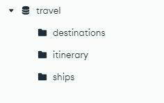

# Project Description: Loading Travel Documents into Cosmos DB for MongoDB VCore Vector Store

## Overview
This project loads documents into a Cosmos DB for MongoDB VCore Vector Store for use by the AI Travel Agent.

## Features
- Integration of LangChain Loaders for seamless document loading into Cosmos DB for MongoDB VCore Vector Store.
- Demonstrates how to set up and configure the environment for document  loading tasks.

## Requirements
- Azure subscription for deploying Cosmos DB for MongoDB VCore and Azure Storage Account.
- Python environment with LangChain and Azure SDK installed.
- Basic knowledge of MongoDB and Azure Cosmos DB

## Usage
1. Create a new **'free-tire'** [Azure Cosmos DB for MongoDB vCore Resource](https://learn.microsoft.com/en-us/azure/cosmos-db/mongodb/vcore/quickstart-portal)in your Azure subscription.
2. Clone the repository to your local machine.
3. Create **.env** file and populate:
- OPENAI_API_KEY=''
- MONGO_CONNECTION_STRING=''
4. Create pythonn env: 
```
python -m venv venv
```
5. Install Requirements:
```
venv\Scripts\activate
python -m pip install -r requirements.txt
```
6. Load sample documents [main.py](main.py)
```
python main.py
```

### Verify documents in Cosmos DB
